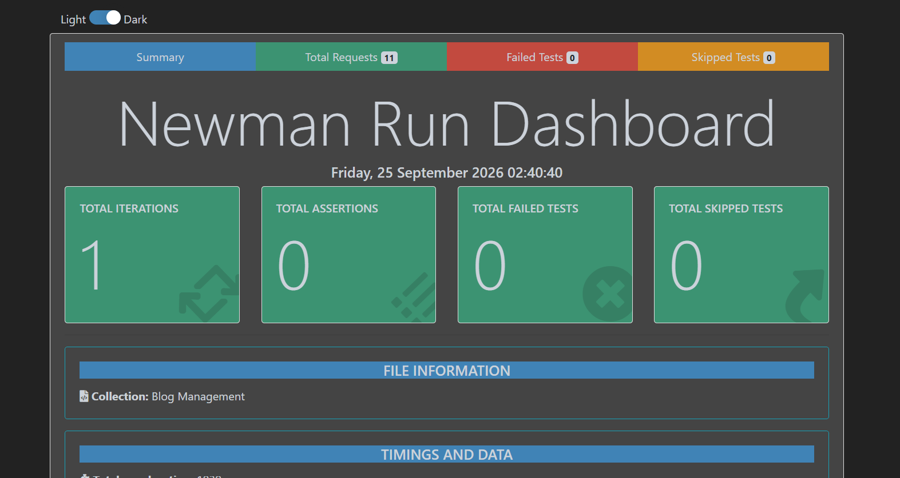

<div align="center">


<br/>

[](https://nodejs.org/)
[](https://expressjs.com/)
[](https://www.mysql.com/)
[](https://www.postman.com/)
[](https://www.npmjs.com/package/newman)
[](#-license)

**A scalable, secure, and structured RESTful Blog Engine** — built with Node.js, Express, and MySQL, featuring Role-Based Access Control (RBAC), JWT authentication, comprehensive Postman test coverage, and automated HTML test execution reports generated with Newman.

</div>

---

## 📑 Table of Contents

- [Features](#-features)
- [Tech Stack](#️-tech-stack)
- [Project Structure](#-project-structure)
- [API Endpoints](#-api-endpoints)
- [Setup & Installation](#️-setup--installation)
- [Automated Testing](#-automated-testing-postman--newman)
- [Sample Test Report](#-sample-test-report)
- [License](#-license)

---

## 📌 Features

| | |
|---|---|
| 🔐 **Authentication & Security** | Secure registration, login, JWT authorization token generation, and password hashing via `bcrypt`. |
| 🛡️ **Role-Based Access Control** | Enforced authorization differentiating regular `user` operations from privileged `admin` actions. |
| 👤 **User Management** | View and update user profiles, change passwords, and manage account statuses (`isActive`). |
| 📝 **Comprehensive Blog Operations** | Full CRUD functionality with author associations, category filtering, and search query parameters. |
| 🧪 **Automated API Testing** | Pre-configured Postman collection with assertions for status codes, schemas, and response validation — plus interactive visual HTML reports via `newman-reporter-htmlextra`. |

---

## 🛠️ Tech Stack

| Layer | Technology |
|---|---|
| Backend Runtime | Node.js |
| Web Framework | Express.js |
| Database | MySQL (`mysql2/promise`) |
| Authentication | JSON Web Tokens (`jsonwebtoken`), Bcrypt |
| API Testing & Automation | Postman, Newman, Newman HTML Extra Reporter |

---

## 📂 Project Structure

```text
blog-rest-api/
├── reports/
│   └── report.html                            # Automated visual Newman test execution report
├── Blog Management.postman_collection.json    # Exported Postman collection
├── app.js                                      # Express application and route definitions
├── initDb.js                                   # Database schema initializer
├── seed.js                                      # Seeds initial admin & user accounts
├── package.json
└── README.md
```

---

## 📋 API Endpoints

### 1. Authentication

| Method | Endpoint | Description | Access |
|---|---|---|---|
| `POST` | `/api/auth/register` | Register a new user | Public |
| `POST` | `/api/auth/login` | Authenticate credentials & return JWT | Public |

### 2. User & Profile Management

| Method | Endpoint | Description | Access |
|---|---|---|---|
| `GET` | `/api/users/profile` | Get current logged-in user profile | Authenticated User |
| `PUT` | `/api/users/profile/update` | Update personal details (first/last name) | Authenticated User |
| `PATCH` | `/api/users/password` | Change user password | Authenticated User |
| `GET` | `/api/users` | Retrieve all registered users | Admin Only |
| `GET` | `/api/users/:id` | Get specific user by ID | Admin Only |
| `PATCH` | `/api/users/:id/status` | Activate or deactivate user account | Admin Only |

### 3. Blog Management

| Method | Endpoint | Description | Access |
|---|---|---|---|
| `GET` | `/api/blogs` | Get all published blogs (supports `?title=` and `?category=`) | Public |
| `GET` | `/api/blogs/:id` | Get specific blog by ID | Public |
| `POST` | `/api/blogs/create` | Create a new blog post | Authenticated User |
| `PUT` | `/api/blogs/update/:id` | Update own blog post | Author / Admin |
| `DELETE` | `/api/blogs/delete/:id` | Delete a blog post | Author / Admin |

---

## ⚙️ Setup & Installation

**1. Clone the repository**

```bash
git clone https://github.com/EbnulAhsan/blog-api-automation.git
cd blog-api-automation
```

**2. Install dependencies**

```bash
npm install
```

**3. Configure environment variables**

Create a `.env` file in the root directory:

```env
PORT=5000
DB_HOST=localhost
DB_USER=root
DB_PASSWORD=your_mysql_password
DB_NAME=blogdb_api
JWT_SECRET=your_jwt_secret_key
```

**4. Initialize database & seed data**

```bash
node initDb.js
node seed.js
```

> **Default seed credentials**
> Admin: `admin@example.com` / `password123`
> User: `john@example.com` / `password123`

**5. Start the server**

```bash
node app.js
```

The server will start running at **http://localhost:5000**.

---

## 🧪 Automated Testing (Postman & Newman)

**1. Install Newman and the HTML Extra reporter**

```bash
npm install -g newman newman-reporter-htmlextra
```

**2. Execute tests & generate an HTML report**

Ensure your backend server is running (`node app.js`), then in a separate terminal:

```bash
newman run "Blog Management.postman_collection.json" -r htmlextra --reporter-htmlextra-export ./reports/report.html
```

**3. View the test report**

Open the generated report directly in any web browser:

```powershell
# Windows (PowerShell)
Invoke-Item .\reports\report.html
```

Or manually open `reports/report.html` in your browser.

---

## 📊 Sample Test Report

The Newman HTML Extra report gives a full visual breakdown of every run — total requests, assertions, failed and skipped tests, timings, and collection metadata.

<div align="center">

</div>

---

## 📄 License

This project is licensed under the [MIT License](LICENSE).

<div align="center">

Made with ❤️ by [Md. Ebnul Ahsan](https://github.com/EbnulAhsan)

</div>
